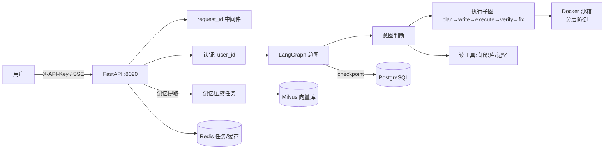

# CodeMind —— 会写代码、能跑代码、会自我修复的对话 Agent

<div align="center">

**从「RAG 问答助手」演进为「代码执行 Agent」：LLM 不只回答问题，而是动手写代码、在隔离沙箱里运行、按测试自愈迭代。**

[](https://fastapi.tiangolo.com)
[](https://langchain-ai.github.io/langgraph/)
[](https://docker.com)
[](https://milvus.io)
[](https://postgresql.org)
[](https://redis.io)
[](https://pytest.org)
[](https://github.com/features/actions)
[](LICENSE)

</div>

## 🎯 项目定位

**CodeMind 是一个「能动手的对话 Agent」**：用户说一句「用 Python 算 1 到 100 的和」，它不是背答案，而是真正走一遍 **规划 → 写代码 → 隔离沙箱运行 → 拿真实输出 → （必要时）按测试自愈修复** 的完整链路，把**真实执行结果**返回给你。

项目从 echomind（RAG 个性化问答助手）演进而来：继承了其长期记忆 / 知识库能力，核心新增了 **代码执行引擎** 与 **生产级工程化**。

## ✨ 核心能力

### 1️⃣ 对话 + 执行总图（LangGraph）
手写 `StateGraph`（弃用 `create_agent`），四个节点职责单一：
```
intent（意图判断）→ chat / exec（执行子图）/ read（读知识库·记忆）
```
- 意图判断用 `with_structured_output` 结构化输出（intent + reasoning），鲁棒可解释
- **执行子图**：`plan → write → execute → verify → fix` 自愈循环，带**熔断**（重试预算用尽诚实收尾，不无限循环）

### 2️⃣ 代码沙箱（Docker 分层防御，M1/M6）
每个任务一个**一次性容器**，用完即毁，分层隔离：
| 层 | 措施 |
|---|---|
| 网络 | `--network=none` 断网 |
| 文件 | rootfs 只读，仅 `/tmp` tmpfs 限量可写 |
| 权限 | 非 root（`nobody`）+ `cap_drop=ALL` + `no-new-privileges` |
| 系统 | 自定义 seccomp（禁 ptrace/mount/pivot_root 等逃逸 syscall） |
| 资源 | 内存 / CPU / pids / 超时 watchdog 强杀 / 输出截断 |
| 前置 | AST 静态审查（危险 import / 调用 / 路径越界） |
| 供应链 | 镜像白名单 + digest 锁定（`python:3.12-slim@sha256:...`） |

### 3️⃣ 长期记忆（继承 echomind）
- 对话流结束后异步写入 `raw_conversations`，后台任务定时压缩提取
- 四类记忆（摘要/语义/情节/程序）+ 用户画像，Milvus 混合检索
- 程序性记忆注入写码提示词：**记住用户编码偏好**（P0-1b）

### 4️⃣ 会话隔离（PostgreSQL checkpoint）
- `langgraph-checkpoint-postgres` 持久化对话历史，按 `thread_id` 隔离
- 多轮上下文自动恢复，会话互不串

### 5️⃣ 生产化（P0/P1）
| 维度 | 落地 |
|---|---|
| 认证 | `X-API-Key` → user_id（端点只信认证上下文，不信请求参数） |
| 多租户 | 按用户配额（`QUOTA_USER_<id>_MEM/PIDS/...`）、任务命名空间隔离 |
| 可观测 | request_id 贯穿 + JSON 单行日志 + `/health` 四依赖探活 |
| 攻击面 | 镜像/网络白名单 + 全局/每用户并发上限 + 孤儿容器回收 |
| 部署 | `Dockerfile` + `docker-compose.prod.yml`（restart/资源/日志/healthcheck）+ 密钥 env 注入 |
| CI | GitHub Actions：lint + 单元 + 集成（PG/Redis services） |

### 6️⃣ 测试与安全回归（P1）
- **pytest 套件 36 用例**（16 单元 + 20 集成，全绿）+ 原 9 冒烟脚本
- **安全回归自动化**：`security_cases.yaml` 全量攻击用例（静态拦截 + 资源滥用双重防御断言）
- 评测四层：功能 / 自愈 / 安全 / 成本（token 记账 + bootstrap CI）

## 🏗️ 系统架构



## 🚀 快速开始

### 环境要求
- Python 3.12+、Docker（沙箱必需）
- 依赖服务：PostgreSQL 16 / Redis 7 / Milvus 2.5（本仓库提供 `docker/milvus-compose.yml`）

### 1. 克隆并安装
```bash
git clone <your-repo-url> EchoMind-master
cd EchoMind-master
python -m venv .venv && source .venv/bin/activate
pip install -r requirements.txt -r requirements-sandbox.txt -r requirements-dev.txt
```

### 2. 配置 `.env`
参考 `.env.example`，填 `DASHSCOPE_API_KEY`（DeepSeek key）等。密钥文件已在 `.gitignore` 保护。

### 3. 起依赖服务
```bash
# Milvus（etcd + minio + milvus 三件套）
docker compose -f docker/milvus-compose.yml up -d
# PostgreSQL / Redis 见 docker-compose.prod.yml（或本机已有实例）
```

### 4. 启动服务
```bash
cd backend
uvicorn chat.server:app --host 0.0.0.0 --port 8020
```

### 5. 发一个对话（带认证）
```bash
curl -N -X POST http://localhost:8020/api/sandbox/chat \
  -H "Content-Type: application/json" \
  -H "X-API-Key: devkey1" \
  -d '{"message": "用python计算1加到100的和", "thread_id": "t1"}'
```

## 📖 API

| 端点 | 说明 |
|---|---|
| `POST /api/sandbox/chat` | 对话（SSE 流式）；需 `X-API-Key`；返回 `status/token/done` 事件 |
| `GET /health` | 依赖探活（PG/Redis/Milvus/Docker），无需认证 |

认证：`X-API-Key` 头 → user_id（见 `.env` 的 `API_KEYS=key:user,key:user`）。

## 🧪 测试

```bash
# pytest 套件（单元 + 集成，需 Docker/Redis/PG 在线）
./.venv/bin/python -m pytest -q          # 36 用例
# 原冒烟脚本回归
./backend/test/run_all.sh                # 9/9
```

## 📦 生产部署

```bash
cp .env.prod.example .env.prod   # 填真实密钥
docker compose -f docker-compose.prod.yml up -d --build
docker compose -f docker-compose.prod.yml ps   # 6 服务，全部 healthcheck
```

## 📁 项目结构

```
backend/
├── chat/            # FastAPI 服务、LangGraph 总图、流式、checkpoint、LLM
├── workflow/        # 执行子图（plan→write→execute→verify→fix + 自愈熔断）
├── sandbox/         # Docker 沙箱（executor/security/limits/concurrency/seccomp）
├── verifier/        # 输出比对（exact/fuzzy/float）
├── tasks/           # 任务状态机（Redis，多租户命名空间）
├── evals/           # 评测四层 + 安全用例
├── tests/           # pytest 套件（36 用例）
├── test/            # 冒烟脚本（run_all.sh）
├── auth.py          # API Key 认证
├── observability.py # JSON 日志 + request_id
└── health.py        # 依赖探活
docs/                # PLAN_V2 + 分析文档（01/02/03）+ 执行追踪
docker/              # Milvus 编排
docker-compose.prod.yml  # 生产编排（app+PG+Redis+Milvus）
.github/workflows/ci.yml # CI
```

## 🗺️ 路线图（已执行）

- **M0-M6**：环境 → 沙箱 → 对话+执行 → 自愈 → 会话隔离+任务 → 评测 → seccomp+安全评测
- **P0（上线前）**：认证/多租户、daemon 攻击面、部署/密钥、可观测性 ✅
- **P1（安全深化）**：pytest 套件化、安全回归、CI、镜像 digest 锁定、孤儿回收 ✅
- **P2（规模/合规）**：任务队列/限流/并发池、备份/审计/隐私、成本配额、前端面板（待做）

## 📄 文档

- `docs/05_memoryforge_guide.md` — **技术详解（面试速成）**：每块关键技术的通俗讲解 + 面试话术
- `docs/PLAN_V2.md` — 权威规划
- `docs/01_echomind_analysis.md` / `docs/02_codemind_evolution.md` / `docs/03_production_gap.md` — 演进与差距分析（含 P0/P1/P2 执行追踪）
