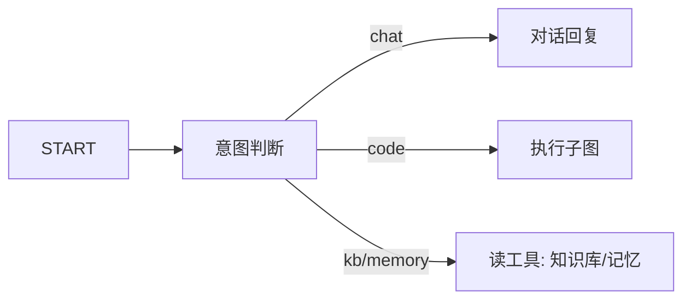

# MemoryForge 技术详解（面试速成版）

> 一句话定位：**MemoryForge（原名 CodeMind）是一个「会写代码、能跑代码、会自我修复、记得住你」的对话 Agent。** 它不是背答案的聊天机器人，而是用户说一句「用 Python 算 1 加到 100」，它真正走一遍 *规划 → 写码 → 隔离沙箱运行 → 拿真实输出 → 不过测试就自愈重写* 的完整链路，把**真实执行结果**交给你。

这份文档用大白话讲清楚每一块技术细节，每块都能在面试里讲 30 秒到 3 分钟。

---

## 0. 技术栈总览（先记住这张表）

| 层 | 技术 | 干什么 |
|---|---|---|
| API | FastAPI + SSE 流式 | 对话接口，打字机效果 |
| 编排 | LangGraph（手写状态机） | 对话总图 + 执行子图，替代 `create_agent` |
| LLM | DeepSeek（OpenAI 兼容） | 意图判断 / 写码 / 修复 / 对话 |
| 沙箱 | Docker（一次性容器） | 隔离执行用户代码，六层防御 |
| 记忆 | Milvus 向量库 + PostgreSQL | 长期记忆 + 会话持久化 |
| 缓存/限流/成本 | Redis | 限流、并发、token 记账 |
| 测试 | pytest 62 用例 + 安全回归 + GitHub Actions | 全链路保障 |

---

## 1. 对话总图：为什么手写 LangGraph 而不是用现成 Agent（面试高频）

**大白话**：市面上 `create_agent` 能快速搭一个"会调工具"的 Agent，但内部是黑盒——它怎么决定下一步、调用什么、失败怎么处理，你说了不算。我**弃用 create_agent，用 LangGraph 手写状态机**，每一步都是自己控制的、看得见的、能测的。

**图长这样**：



**四个节点，职责单一**（面试讲这段）：
- **intent 意图判断**：用 `with_structured_output` 让 LLM 输出**结构化 JSON**（`{intent, reasoning}`），比关键词匹配鲁棒，还带一句判断理由（可解释）。
- **chat 对话回复**：多轮历史靠 `add_messages` 自动累积（短期记忆）；P2 起还会检索长期记忆注入（下面讲）。
- **exec 执行子图**：真正的重头戏，见第 2 节。
- **read 读工具**：查知识库 / 查记忆，调 Milvus + PostgreSQL 的 async 接口。

**面试话术**：*"我不依赖框架的黑盒 Agent 封装，而是用 LangGraph 手写状态机——节点可测、状态可见、路由可控。这对生产很重要：出问题时你能 pinpoint 是哪一步，而不是面对一个黑盒。"*

---

## 2. 执行子图：自愈循环 + 熔断（最亮的一块）

**大白话**：用户让写代码，不是 LLM 直接给一段代码就完事——而是走一条"工程化流水线"：

```
plan（规划方案）→ write（写代码）→ execute（沙箱跑）→ verify（拿测试比对）→ 不过？→ fix（重写）→ 再跑
```

**自愈循环**：写出的代码第一次跑失败很正常。verify 节点用**确定性比对**（不是让 LLM 再猜一次）判断对错：
- `exact` 精确匹配 / `fuzzy` 忽略大小写空白 / `float` 浮点容差——按任务类型选模式
- 比对失败就把具体报错喂回 LLM 让它修，最多重试 N 轮

**熔断（面试重点）**：重试次数是**硬编码在状态机里**的（`attempts >= max_attempts` 就停），不是靠 LLM 自觉。为什么？因为我踩过坑——**用"提示词让模型别无限循环"是软约束，模型会无视**。硬计数保证：预算用尽就诚实收尾，绝不无限烧钱。

**token 记账**：plan/write/fix 每一步的 LLM token 都累加进 state，用于成本统计（P2 起全节点都记）。

**面试话术**：*"我把'代码执行'做成了带反馈闭环的流水线：写码→执行→确定性验证→失败则修复重试，并用电闸式熔断防止无限循环。关键设计是验证用确定性比对、重试预算硬编码——把'AI 的不可靠'关进'工程化的笼子'。"*

---

## 3. Docker 沙箱：六层防御（安全面试主场）

**大白话**：用户让 Agent 跑代码，这代码可能是恶意代码（删文件、反弹 shell）。所以代码要在**一次性的、几乎啥都干不了的容器**里跑，用完就销毁。

**六层防御（每一层都能展开讲）**：

| 层 | 手段 | 一句话解释 |
|---|---|---|
| ① 网络 | `--network=none` | 直接断网，代码想外联？没门 |
| ② 文件 | rootfs 只读，仅 `/tmp` tmpfs 限量 | 代码想改容器文件？根本没地方写 |
| ③ 权限 | 非 root（`nobody`）+ `cap_drop=ALL` + 禁提权 | 即使有漏洞也提不了权 |
| ④ 系统 | 自定义 seccomp | 禁掉 ptrace/mount/pivot_root 等逃逸 syscall |
| ⑤ 资源 | 内存/CPU/进程数/超时/输出量 | 死循环超时强杀、fork 炸弹 pids 拦住、内存 OOM 兜底 |
| ⑥ 前置 | AST 静态审查 | 危险 import（subprocess/socket）/危险调用（eval/exec）/路径越界，进容器前就拦 |

**配套（P0/P1/P2 加的）**：
- **镜像白名单 + digest 锁定**：只能跑 `python:3.12-slim@sha256:2c94...`，防拉任意镜像、防 tag 被篡改
- **并发上限（分布式）**：全局默认 4 + 每用户 2，用 **Redis + Lua 原子脚本**实现——多实例也共享同一份计数（进程内信号量在多实例下会失效）。槽位带 TTL，进程崩了自动释放
- **孤儿回收**：容器打 `codemind.sandbox` 标签，启动时清残留
- **执行审计**：谁在何时执行了什么代码（长度/退出码/超时/拦截）都进结构化日志，配 request_id 全链可查

**实测数据（面试加分）**：11 个安全攻击用例全绿——`rm -rf /`、`subprocess`、读 `/etc/shadow`、`eval` 混淆、fork 炸弹、无限内存、CPU 死循环、写满磁盘，**全部被拦或被资源配额兜底**。

**诚实边界（主动讲，加分）**：容器共享宿主内核，遇到内核漏洞理论上可逃逸。生产级应上 **gVisor/Kata/VM 隔离**（E2B 就用的 Firecracker）。面试主动说这个，比藏着强——说明你知道安全的天花板在哪。

**面试话术**：*"我用六层纵深防御做代码沙箱：断网、只读、非 root、去能力、seccomp、资源配额，加上容器前的 AST 静态审查。每个维度都有对应攻击用例回归，11 个全绿。我知道容器隔离的边界是共享内核，生产上 VM 级隔离，这是诚实的安全认知。"*

---

## 4. 记忆机制：四类记忆 + 混合检索 + 提取（面试"个性化"主场）

**大白话**：很多聊天机器人每次对话都"失忆"。MemoryForge 让 AI 真正"记住"用户——记得你喜欢什么、说过什么、偏好怎么写代码。

**四类记忆（模拟人脑分层）**：
| 类型 | 记什么 | 例子 |
|---|---|---|
| 摘要记忆 | 对话要点 | "用户上个月定了 Python 学习计划" |
| 语义记忆 | 稳定事实 | "用户叫小明，喜欢喝美式不加糖" |
| 情节记忆 | 具体事件 | "上次让 AI 算过斐波那契" |
| 程序记忆 | 方法偏好 | "用户偏好 Python 写代码带中文注释" |

**写入（后台提取）**：对话结束后异步写入 `raw_conversations`，后台任务（每 3 分钟）扫描未压缩会话 → 超过 token 阈值 → LLM 提取成四类记忆 + 用户画像 → 存 Milvus。

**检索（混合检索）**：用户提问时，把问题向量化，对四类记忆**并行**做 **稠密向量（语义）+ 稀疏 BM25（关键词）混合检索 + RRF 融合排序**，再加"综合评分"（语义分 + 时近性衰减 + 重要性加权）。检索失败自动降级为纯稠密检索。

**注入（P2 补齐）**：程序记忆注入"写码提示词"（写代码按你的偏好来）；P2 起**普通对话也注入**摘要/语义/情节记忆——不再只等用户主动问"你还记得吗"。

**踩坑修复（面试讲"我发现了问题并修掉"）**：
1. **阈值不一致**：`TOKEN_THRESHOLD=1000`（太敏感，稍长对话就触发 LLM 提取烧钱），注释却写 10000——改成 4000 并对齐注释。
2. **Milvus upsert 全字段 bug（像剥洋葱）**：更新记忆访问时间一直失败但被 try/except 静默吞掉。修复时一个字段一个字段暴露：`thread_id` → `memory_type` → `content` → `created_at` → `vector`——Milvus 2.5 的 upsert 会校验所有 schema 字段（含向量索引字段），缺哪个报哪个。最终方案：检索时全字段带出（含原向量），upsert 全字段写回，实测 `upsert_count=1` 彻底修复。面试讲这个：*"我修了一个被静默吞掉很久的 bug，它像洋葱一层层剥开，最后把检索结果的全部字段（含 1024 维向量）带齐一次写入"*。

**面试话术**：*"记忆我用四类分层 + Milvus 混合检索：向量语义 + BM25 关键词双路召回，RRF 融合，再做时近性和重要性加权。写入走后台异步提取不阻塞对话，检索失败自动降级。我还修过一个真实 bug：Milvus 更新访问时间缺必填字段被静默吞掉——现在全链带出，访问时间真正生效。"*

---

## 5. 会话持久化：PostgreSQL checkpoint（多轮不串台）

**大白话**：多轮对话的历史存在哪？MemoryForge 用 LangGraph 的 `AsyncPostgresSaver` 把会话状态存 PostgreSQL，**按 thread_id 隔离**——同一个会话自动恢复历史，不同会话互不串台。

**踩坑（面试讲）**：`from_conn_string` 返回的是异步上下文管理器，**必须 `async with` 包住**，否则连接生命周期不对（手动 `__aenter__` 会关连接）。这个坑排查过。

---

## 6. 认证 + 多租户（P0，从"演示"到"上线"的分水岭）

**大白话**：项目最初 `user_id` 是请求里随便传的——谁都能冒充别人。这是最严重的债。

**修复**：
- **API Key 认证**：客户端带 `X-API-Key` 头，服务端映射成 `user_id`，端点**只信认证上下文**，请求体里的 `user_id` 直接忽略。
- **多租户配额**：按用户解析沙箱配额（`QUOTA_USER_42_MEM=128m`），不同用户不同资源上限。实测 user42 的容器真实拿到 128MiB/32 pids。
- **任务命名空间**：Redis 的 key 带用户前缀（`task:42:*`），租户任务天然隔离。

**实测**：无 key → 401；伪造 `user_id=1` + 坏 key → 401；好 key → 通过且**落库的是 key 映射的 42 而不是伪造的 1**。

---

## 7. 可观测性：request_id + JSON 日志 + 健康检查（P0）

**大白话**：上线后出问题，最怕"日志大海捞针"。所以要"一根绳子串起一个请求"。

- **request_id**：每个请求自动生成（或透传你传的 `X-Request-ID`），写进日志和响应头——一条请求从入口到 LLM 到沙箱的所有日志都带同一个 id，一键查全程。
- **JSON 日志**：统一单行 JSON（时间/级别/logger/request_id/消息），可被日志平台直接解析。
- **健康检查 `/health`**：并行探活 PostgreSQL/Redis/Milvus/Docker 四个依赖，哪个挂了一目了然（实测四依赖全绿）。
- **踩坑**：健康探活不能用缓存的连接单例（跨事件循环会 `Event loop is closed`），要用一次性连接。

---

## 8. 限流 + 成本控制（P2，本次新增）

**大白话**：多租户上线最怕两件事：**恶意高频请求烧你的钱**、**单用户把资源吃光**。

**限流（Redis 滑动窗口）**：
- 双层：per-IP（中间件，拦未认证洪水）+ per-user（认证后，防单用户刷）。
- 为什么滑动窗口不是固定窗口：固定窗口在边界会"两倍突刺"（前窗口尾+后窗口头各打满），滑动窗口按真实时间窗口计数更平滑。
- 实现：Redis ZSET，成员=时间戳，每请求清掉窗口外的再计数，均摊 O(1)。实测 `rl:user:42`/`rl:ip:127.0.0.1` 都在跑。

**成本（Redis per-user 日预算）**：
- 全节点 token 记账（intent/chat/exec，之前 chat/intent 漏算），请求结束按实际 token 累进 Redis，次日 00:00 过期。
- 请求前预算检查（超限熔断返回 429）。实测一次对话 `cost:20260827:42 = 246`。

**面试话术**：*"我补了两道经济防护：限流用 Redis 滑动窗口双层（IP+用户），成本用 per-user 日 token 预算 + 熔断。并且把之前漏算的 chat/intent token 记账补全——成本统计完整才谈得上配额。"*

---

**P2 追加（2026-08-27）——记忆淘汰 / 审计落库 / 演示面板**
- **记忆健康**：低频（>90 天未访问）+ 低价值（importance<0.3）记忆自动淘汰（后台每 30 分钟），控制记忆库规模防检索噪声。
- **审计落库**：沙箱执行审计写入 PostgreSQL `sandbox_audit` 表（谁/何时/代码长度/退出码/是否被拦），合规可查、面板可看。
- **演示面板**：Streamlit 四区块——对话（SSE）/ 依赖健康 / 成本看板（Redis）/ 沙箱审计（PG），让新能力「看得见摸得着」。
- **成本可见性**：SSE `done` 事件带本次 token 消耗（客户端/用户能看到单次对话花多少）。
- **记忆访问时间 Redis 节流**：Milvus upsert 每次检索都要全字段（含 1024 维向量）写回太贵——加 Redis 触摸节流（默认 60s 内同一记忆只 upsert 一次），写放大降一个数量级，Redis 挂了自动回退直写。

## 9. 测试 + CI：42 用例 + 安全回归 + 自动流水线（P1）

- **pytest 套件 42 用例**：16 单元（配额/并发/认证/比对/限流/成本）+ 26 集成（沙箱/安全/任务/记忆相关）。
- **安全回归自动化**：`security_cases.yaml` 全量攻击用例动态生成测试，每次沙箱改动自动跑。
- **GitHub Actions CI**：lint（语法编译）+ 单元 + 集成（PG/Redis 用 services，沙箱用 runner 自带 Docker）。
- **CI 踩坑（讲"排查过真实 CI 失败"）**：第一次跑全红——因为 CI 漏装 `requirements-sandbox.txt`（docker SDK 在那个文件里），`import docker` 拿到 runner 预装的残缺模块（没有 `DockerClient`）；以及 lint 里 `pytest --collect-only` 需要全依赖。修复后 **全绿**。

---

## 10. 部署：容器化 + 编排 + 密钥治理（P0/F）

- `Dockerfile`：分层缓存（依赖层先装、代码层后拷），模型走 volume 不烧进镜像。
- `docker-compose.prod.yml`：一键起全栈（app + PG + Redis + Milvus 三件套），每个服务有 restart 自愈 / 内存 CPU 上限 / 健康检查 / 日志轮转。
- **密钥治理**：`.env`/`.env.prod` 进 `.gitignore`，密钥经环境变量注入不烧进镜像。compose 有个经典坑：`${VAR}` 是 compose 插值（读根 `.env`），不是服务的 `env_file`——DATABASE_URL 放 `.env.prod`，`POSTGRES_PASSWORD` 放根 `.env`。

---

## 11. 面试问题预测 + 答法

| 面试官问 | 你怎么答（一句话钩子） |
|---|---|
| "这个项目最大的难点？" | 沙箱安全：把不可信的 AI 生成的代码关进六层防御的笼子，且每层都有攻击用例证明 |
| "为什么不用现成 Agent 框架？" | 黑盒不可控不可测，我手写状态机，节点可测、熔断硬编码、成本可算 |
| "代码执行失败了怎么办？" | 确定性验证 + 修复循环 + 硬熔断，不无限烧钱 |
| "怎么防用户恶意使用？" | 认证（不信请求参数）+ 多租户配额 + Redis 限流 + per-user 成本熔断 |
| "AI 会'忘记'吗？" | 四类记忆 + Milvus 混合检索 + 后台异步提取 + 对话全场景注入 |
| "上线后怎么排查问题？" | request_id 全链贯穿 + JSON 结构化日志 + 四依赖健康探活 |
| "怎么保证质量？" | 62 个 pytest + 安全回归 + GitHub Actions CI，提交即验证 |

---

## 12. 已知边界（诚实清单，面试主动讲）

1. **沙箱是容器级隔离**：共享宿主内核，生产应上 gVisor/Kata/Firecracker（VM 级）。（未做）
2. **API Key 仍是登录凭证的静态映射**：已升级为「API Key 换短时 JWT（HS256，过期+签名+jti）」传输；但用户表 + 密码哈希 + 刷新令牌未做（登录凭证仍是环境变量映射）。
3. **记忆淘汰是"低频淘汰 + 容量上限"而非精确 LRU**：已有访问时间节流（Redis）+ 维护任务淘汰低频低价值 + 每人最多 N 条（MEM_MAX_PER_USER）；更细粒度的过期/分类型配额未做。
4. **成本记账是"近似但已收口"**：verify 的 judge LLM 调用已纳入 exec 记账，请求级账单更完整；但评测级与请求级仍是两套累加口径，生产应统一为一次请求一个 usage 账单。
5. **AST 审查是"友好拦截"**：不承诺对抗性逃逸，真正的边界是容器/VM 隔离。

---

## 13. 本轮新增：数据合规 + 上下文压缩 + 异步任务队列（A/C/B）

### A 数据合规（GDPR 删除权）
- **`DELETE /api/user/data`**：只删当前认证用户自己的数据（不信请求参数）。
- 删哪里：PostgreSQL（对话 + 画像 + 知识库级联）+ Milvus（记忆/知识库向量）+ Redis（成本/限流/记忆触摸/任务）。
- **降级容错**：Milvus 挂时其余存储照删不阻塞——实测 PG 16→0、Redis keys 清空。
- 配套 `scripts/backup.sh`：PG dump + Redis RDB（备份/恢复闭环）。
- 面试话术：*"删除权是合规红线，我做成单接口全链路，且任一存储故障不拖垮整体。"*

### C 长上下文压缩（控窗口 + 省 token）
- chat 图加 `compress` 节点（START 后、意图判断前）：消息超阈值（默认 20）保近舍远，用 `RemoveMessage` 删早期。
- 测试：25 条删 5、10 条不触发、无 id 跳过——纯逻辑单测。
- 面试话术：*"长对话是 token 黑洞，我在意图判断前先压缩，窗口可控、成本可算。"*

### B 异步任务队列（长耗时任务不阻塞请求）
- 面试场景：*"评测/批量执行这类重活怎么办？"* → 队列 + worker。
- `TaskManager.enqueue` → Redis List FIFO（`tasks:queue`，value 带用户前缀路由回命名空间）；worker `BRPOP` 消费，多实例可横向扩展。
- 状态机复用：`queued→running→succeeded/failed`，worker 只认 queued，非法流转自动拒绝。
- API：`POST /api/tasks`（入队即返回 task_id）/ `GET /api/tasks/{id}`（轮询状态）/ `GET /api/tasks`（列表）；认证即命名空间，跨用户 404。
- 端到端：POST 任务 → worker 2s 内沙箱执行 → `succeeded` 含 stdout/duration。
- **接入对话图**：新增 `task` 意图 + `task` 节点——说「帮我后台跑个任务：<代码>」→ 入队返回任务号；说「查任务 <任务号>」→ 返回状态/结果；说「我的任务列表」→ 列出当前用户最近任务。LLM 结构化抽取（`create/status/list + code/task_id`），核心逻辑 `_apply_task_request` 与 LLM 分离可单测。对话图因此有了「异步出口」。
- 面试话术：*"请求线程只入队，worker 消费回写状态，天然支持横向扩；对话层也接上了——用户一句话就能提交/查询/列后台任务，形成闭环。"*

---

## 14. 深度深化：合规/认证/安全/健壮性/治理（本轮 6 块）

### A+ 数据导出（GDPR 导出权，与删除权对称）
- `GET /api/user/data` 打包当前用户全部数据：PG（对话+画像）+ Milvus（记忆）+ Redis（当日成本）；Milvus 挂了降级不阻塞。
- 面试话术：*"删除权做过了，导出权补上——合规故事才完整；导出/删除走同一套数据地图，一处不漏。"*

### JWT 动态认证（手写 HS256，标准库）
- `POST /api/auth/login`：API Key（长期静态凭证）换短时 JWT（`sub/iat/exp/jti`，签名防篡改、过期限时、jti 可吊销）；后续 `Authorization: Bearer <jwt>`；兼容旧 `X-API-Key`。
- 无第三方库——base64url + HMAC-SHA256 手写，三段结构现场可讲。
- 面试话术：*"静态凭证私藏、动态令牌传输；过期+签名+jti 是令牌安全三件套。"*

### 敏感信息脱敏（数据泄漏防线）
- 沙箱执行出口统一 `redact_secrets`：`sk-`/`ghp_`/`AKIA`/JWT/Bearer/`key=xxx` 等格式打码。
- 面试话术：*"六层防御挡代码行为，脱敏挡数据泄漏——代码能合法打印环境变量里的密钥，输出层必须打码。"* 诚实：友好拦截，只能拦已知格式。

### worker 失败重试 + 死信队列（B+）
- 失败 → `retries` 未满 → 回 queued + 延迟 ZSET（指数退避 2s/4s…封顶 30s）；耗尽 → failed + 进 `tasks:dlq` 死信（人工排查/重放）。
- 状态机新增合法流转 `RUNNING→QUEUED`（重试语义）。
- 面试话术：*"直接重试会闪电风暴打爆下游；延迟队列做退避，任务不丢、可追踪。"*

### 记忆容量上限 + 单条删除（治理补全）
- `GET /api/memories` 列记忆、`DELETE /api/memories/{id}` 单删（按 user_id 校验只能删自己的）；后台维护任务按 `MEM_MAX_PER_USER` 收紧——超了删最久未访问（近似 LRU）。
- 面试话术：*"记忆只增不减会失控，硬上限 + 单条删除 = 记忆库可治理。"*

### 成本精确 + 趋势图
- verify 的 judge 是一次真实 LLM 调用、之前漏算——补进 exec 记账；`add_usage` 写当日快照（hist key，31 天 TTL），dashboard 画近 7 日曲线。
- 面试话术：*"成本从'当前值'升级为'可回顾的曲线'，且每一条 LLM 调用都在账上。"*

---

*对应代码：`backend/`（chat/workflow/sandbox/verifier/tasks/evals/tests）、`docs/01~04`、`docker-compose.prod.yml`、`.github/workflows/ci.yml`。*
