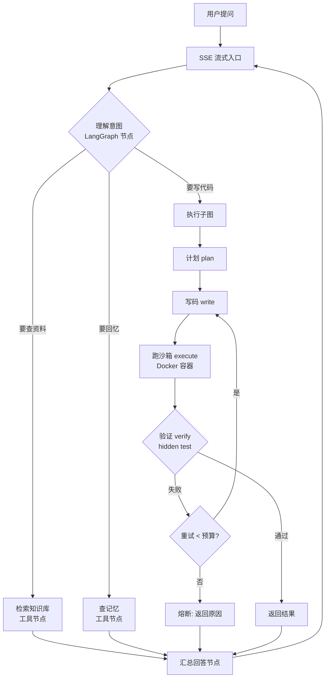

# CodeMind V2 完整计划（重排版）

> 定位：基于 echomind 底座改造的「代码执行 Agent」
> 架构：**方案乙**——全弃 `create_agent`，用 LangGraph 手写对话 + 执行总图
> 目标：面试大放异彩——每个模块学透、能讲、有数据支撑
> 生成日期：2026-08-19 ｜ 取代 v1 交接文档（`PROJECT_PLAN.md` 保留作历史参考）

---

## 0. 项目定位（诚实版）

**CodeMind**：会写代码 → 沙箱跑 → 确定性验证 → 自愈 → 交付。

一句话区分 deepresearch：

| | deepresearch | CodeMind |
|---|---|---|
| 管 | **读**（检索 / 报告） | **做**（执行 / 验证） |
| 技术栈 | deepagents + 工具链 | LangGraph 自研状态机 + Docker 沙箱 |

**定位表述：生产味演示，不是「企业级」。** 面试主动讲清安全边界反而加分——诚实呈现权衡，比吹牛稳。

面试叙事三层（每个模块都能落到这三层）：
1. **工程能力**：FastAPI + LangGraph 状态机 + Docker 编排 + 流式
2. **安全深度**：分层防御 + 可量化的逃逸/危险操作拦截测试
3. **评测量化**：四层指标 + bootstrap 置信区间（方法论平移自 deepresearch，形成"方法论连续性"的故事）

---

## 1. 关键决策（已拍板，勿改）

| 决策点 | 结论 | 理由 |
|---|---|---|
| 架构 | 方案乙：弃 `create_agent`，LangGraph 手写 | 学得最透；执行循环是一等公民；面试更硬 |
| 执行引擎 | Docker 一次性容器 + 资源配额 + `--network=none` | 资源级隔离足够演示；可深挖 seccomp / cap-drop |
| 自愈 | 硬计数熔断（非软提示） | deepresearch 教训：软约束被 LLM 无视 |
| 验证 | hidden test 确定性验证 | 比"LLM 自评对错"可靠得多 |
| 对话层 | 最小可用起步：固定系统提示词 + 读工具复用 | 砍掉动态提示词/摘要中间件复刻，精力砸在执行层 |
| 副线 | 压后到 M7 之后 | 不与主线抢时间 |
| 时间 | 充裕，按模块深化 | 每块学透，不赶 |

---

## 2. 架构总图



关键设计原则：
- **对话编排和执行循环全部由代码控制**（方案乙的本质）
- 流式、重试预算、熔断是图的显式节点，不是提示词软约束
- 记忆/知识库作为**可选工具节点**接入，不做核心路径（M2 阶段先固定提示词）

---

## 3. 目标目录结构（在 echomind 基础上新增/改动）

```
backend/
├── main.py              # FastAPI 入口（保留）
├── api.py               # 路由（保留 + 新增 /sandbox/* 与 /tasks/*）
├── config.py            # 配置（保留 + 沙箱配置段）
├── agent/               # [新] 方案乙：LangGraph 对话层
│   ├── graph.py         #   总图：意图→工具/执行→汇总
│   ├── state.py         #   对话状态 + 预算记账
│   └── streaming.py     #   SSE 流式封装（LangGraph stream 事件 → HTTP）
├── workflow/            # [新] 执行子图（差异化核心）
│   ├── exec_loop.py     #   plan→write→execute→verify→fix 子图
│   └── state.py         #   执行状态（重试计数/预算/token 记账）
├── sandbox/             # [新] 沙箱子系统（M1）
│   ├── executor.py      #   DockerExecutor：起容器/抓输出/超时/资源配额
│   ├── security.py      #   危险命令/库黑名单 + 文件越界策略
│   ├── limits.py        #   资源配额（内存/CPU/PID/磁盘/超时）
│   └── scripts/         #   容器内入口脚本（run_python.sh 等）
├── verifier/            # [新] 确定性验证（M3）
│   ├── test_runner.py   #   hidden test 运行 + 分类（通过/失败/超时/异常）
│   └── assertions.py    #   输出比对（exact / fuzzy / 浮点容差）
├── tasks/               # [新] 任务状态机（M4）
│   ├── manager.py       #   Redis 队列：queued→running→succeeded/failed/cancelled
│   └── models.py
├── evals/               # [新] 评测体系（M5）
│   ├── cases/           #   题目集（含 hidden test，JSON/YAML）
│   ├── run_eval.py
│   └── metrics.py       #   四层指标 + bootstrap 置信区间
├── tools.py             # 读工具（复用，注册为 LangGraph 工具节点）
├── memory_manager.py    # 记忆（复用为工具节点）
├── milvus_client.py     # 知识库检索（复用）
└── postgresql_client.py # 复用（+ 产物表/任务表）
data/
├── sandbox/             # [新] 沙箱工作区/产物
└── evals/               # [新] 评测报告
frontend/
├── app.py               # [改] 加沙箱面板（代码展示/运行结果/文件树）
└── style.css
```

---

## 4. 里程碑（按模块深化，不按天排期）

> 每个里程碑都独立可演示。**标注「面试可讲点」的是必须在做的时候就想清楚怎么讲的部分。**

### M0 地基验证（第 1 步）
- **目标**：跑之前的环境坑全部踩平，别让 M1 卡住。
- **内容**：
  1. `.env` 填真实配置（DASHSCOPE_API_KEY / Milvus_url+Token / DATABASE_URL / REDIS_URL）
  2. **验证 DashScope 模型名**：`AGENT_BASE_MODEL=qwen3.5-flash-2026-02-23` 这个名存不存在？不存在就换成官方真实模型名
  3. 启用 Docker（WSL 集成），验证 `docker run hello-world` + `docker run --network=none alpine` 能起
  4. venv 冒烟：`backend` 11 模块 import 全通过 + `import docker`
- **验收**：一条命令能起一个无网络的容器并跑 Python。
- **面试可讲点**：无（纯前置）。但记录下"我如何验证模型名"的过程，体现工程严谨。

### M1 沙箱引擎（安全深度 = 面试王牌）
- **目标**：不依赖 LangGraph、不依赖 echomind，纯 Python + Docker SDK 跑通执行能力。
- **技术要点（学什么）**：
  - Docker SDK 用法：`client.containers.run`、`detach`、`logs`、`wait`
  - 资源配额：`mem_limit` / `cpu_quota` / `pids_limit` / 磁盘上限 / 超时强杀
  - 网络隔离：`--network=none`（默认）
  - 只读 rootfs + 挂载工作目录（代码只能写在指定目录）
  - `no-new-privileges` / `cap-drop=ALL`（M1 可先做，M6 深化讲解）
  - 危险操作拦截：危险命令/库黑名单（`subprocess` 滥用、`shutil.rmtree`、`os.remove`、`/etc/passwd` 读取等）+ 文件越界检查（只允许工作目录内）
- **验收**：
  - 跑通一段 Python，拿 stdout / stderr / 退出码 / 超时
  - 危险命令被拦（有拦截日志）
  - 超时/资源超限被强杀（不挂死宿主机）
- **面试可讲点**：
  - "我是怎么设计分层防御的"（Docker 隔离 → 黑名单 → 资源配额 → 越界检查）
  - "Docker 隔离的边界在哪"（诚实：防失误+一般恶意，防不了对抗性逃逸，那要 Kata/gVisor/VM）
  - "为什么 `--network=none` 默认关网"（防数据外带）

### M2 LangGraph 对话 + 执行层（方案乙核心）
- **目标**：手写对话总图 + 执行子图，SSE 流式输出。这是本项目的学习重心。
- **技术要点（学什么）**：
  - `StateGraph`：状态定义、节点、条件边（conditional edges）
  - 子图（`StateGraph` 嵌套 / `compile` 后作为节点）
  - 流式：`astream` / `stream_mode`（values / messages / updates），事件转发到 SSE
  - checkpoint（M2 可先不做，M4 深做）
  - 执行子图：plan → write → execute → verify → fix，**重试预算硬计数**，超预算熔断
- **对话层策略**：最小可用——固定系统提示词 + 意图判断节点 + 读工具节点（复用 `tools.py` 的记忆/知识库检索，注册为工具节点）。
- **验收**：
  - 对话说"写个冒泡排序"，AI 进入执行子图 → 沙箱跑 → 流式返回结果
  - 说"查我的知识库"能走读工具节点（证明复用成功）
  - 能看到执行子图每一步的流式事件（计划/写码/执行/验证/修复）
- **面试可讲点**：
  - "为什么弃用 `create_agent` 手写 LangGraph"（控制力 vs 黑盒的取舍）
  - "自愈是硬预算不是软提示"（deepresearch 的教训迁移）
  - "执行子图怎么做的状态记账"（重试计数、token、时间预算）

### M3 验证 + 自愈
- **目标**：确定性验证 + 错误反馈工程。
- **技术要点（学什么）**：
  - hidden test 运行与结果分类：通过 / 失败 / 超时 / 异常（编译错 vs 运行错）
  - 输出比对策略：exact / fuzzy / 浮点容差
  - **错误反馈工程**：把测试失败信息（diff、traceback、预期 vs 实际）正确喂回 LLM 让它修复
- **验收**：
  - 故意给错代码，能自愈到通过（统计自愈轮数）
  - 修 3 轮还不行 → 熔断，返回"修不好 + 失败原因"（诚实收尾，不硬编）
- **面试可讲点**：
  - "错误反馈设计为什么重要"（LLM 看不到运行环境，反馈质量决定修复率）
  - "熔断是产品设计不是失败"（超预算返回原因，避免无限烧钱）

### M4 会话 + 任务
- **目标**：还 echomind 的债——会话隔离 + 任务状态机。
- **技术要点（学什么）**：
  - LangGraph checkpoint（Redis）：`thread_id` 真正隔离，两个会话互不串
  - 任务状态机：Redis 队列，queued → running → succeeded / failed / cancelled，可查可取消
- **验收**：两会话并行互不串；任务可查状态、可取消。
- **面试可讲点**：echomind 的债（thread_id 直接用 user_id）怎么被我修掉的——有对比就有故事。

### M5 评测体系（差异化王牌）
- **目标**：四层指标 + bootstrap 置信区间。
- **技术要点（学什么）**：
  - 题目集设计（含 hidden test 的 JSON/YAML）
  - 四层指标：用例级（通过率/编译率）/ 循环级（自愈成功率/平均轮数/超时率）/ 安全级（逃逸拦截率/危险命令拦截率/资源滥用拦截率）/ 成本级（token/执行次数/单题成本）
  - bootstrap 置信区间（deepresearch 方法论平移，形成连续性叙事）
- **验收**：出第一份带置信区间的评测报告（markdown/HTML）。
- **面试可讲点**：全套方法论 + "这是我 deepresearch 验证过的方法论平移"——形成"方法论连续性"的加分故事。

### M6 安全强化 + 上线演练
- **目标**：把安全从"能拦"做到"能讲透 + 可量化"。
- **内容**：seccomp profile、cap-drop 完整清单、镜像瘦身、超时/输出截断、敏感信息过滤、逃逸测试集扩充。
- **验收**：安全级指标全部上报告。
- **面试可讲点**：安全是 AI 应用岗面试的稀缺亮点，这章是最值得花时间的。

### M7 收尾：README / 答辩稿（+ M6 后可选副线）
- **目标**：能讲 + 能演示 + 能自证。
- **内容**：README、一页答辩稿（三层叙事）、演示脚本（几个固定 demo 话术）、可选副线（pandas/出图）。

---

## 5. 安全设计（面试重头戏，提前定调）

**分层防御模型**（每层都有测试用例，M6 量化）：

| 层 | 手段 | 防什么 |
|---|---|---|
| L1 编排层 | 一次性容器 + 超时强杀 + 输出截断 | 失控、无限循环、刷屏 |
| L2 隔离层 | `--network=none` + 只读 rootfs + 工作目录挂载 | 数据外带、篡改 |
| L3 权限层 | `cap-drop=ALL` + `no-new-privileges` + 非 root 用户 | 提权 |
| L4 策略层 | 危险命令/库黑名单 + 文件越界检查 | 误删、越权读 |
| L5 配额层 | mem / cpu / pids / 磁盘上限 | 资源耗尽（拒绝服务） |

**诚实边界（面试必讲）**：
- Docker 容器隔离**防的是"失误 + 一般恶意"**，不是防"对抗性逃逸"（有 kernel 漏洞时容器共享内核）。
- 真正要防逃逸需要 Kata Containers / gVisor / 独立 VM——**这是我们的已知边界，不是盲区**。
- 这句话本身就是面试亮点：知道工具边界的人比盲目吹"完全隔离"的人可信。

---

## 6. 评测四层指标（差异化王牌）

| 层 | 指标 | 说明 |
|---|---|---|
| 用例级 | 通过率 / 编译率 / 运行正确率 | 单题能不能做对 |
| 循环级 | 自愈成功率 / 平均重试轮数 / 超时率 | 自愈机制是否有效 |
| 安全级 | 逃逸拦截率 / 危险命令拦截率 / 资源滥用拦截率 | 安全是否可靠 |
| 成本级 | token / 执行次数 / 单题成本 | 贵不贵 |

全部带 bootstrap 置信区间（样本少时的统计可靠性）。

---

## 7. 成本与观测

- token 记账（对话 + 执行子图分开记）
- request-id 贯穿（deepresearch 经验平移）
- 健康检查：`/health` 探活 4 个依赖（PostgreSQL / Redis / Milvus / Docker）
- 日志：结构化 JSON（deepresearch 的 `JsonFormatter` 经验平移，注意 `extra` 白名单要含 `request_id`）

---

## 8. 环境与依赖（现状）

- ✅ venv 已建：`langchain 1.2.14` / `langchain-classic 1.0.3` / `langgraph 1.1.6` / `pymilvus 2.6.10` / `streamlit 1.56` / `dashscope 1.25.15` / `fastapi 0.135.3`
- ✅ `requirements-sandbox.txt`：`docker 7.1.0`
- ✅ `requirements.txt` 已转 UTF-8（备份 `requirements.utf16.bak`）
- ⏳ `.env` 占位值待填（M0 第一步）
- ⏳ Docker WSL 集成待启用（M0）
- ⏳ DashScope 模型名待验证（M0）

---

## 9. 风险与降级（诚实清单）

| 风险 | 影响 | 应对 |
|---|---|---|
| LangGraph 不熟，M2 卡住 | 核心里程碑 | 先做 M1 建立信心；M2 从最小图（3 节点）起步逐步加；不懂就问/查文档，不硬写 |
| 沙箱安全边界被高估 | 面试翻车 | 提前定调"生产味演示 + 诚实边界"（见 §5） |
| Milvus/记忆那套拖慢进度 | 主线被旁路拖累 | M2 只把读工具当可选节点，不先做知识库深度集成 |
| 评测样本太少 | 指标不可信 | bootstrap 置信区间兜底，报告标注样本量 |
| echomind 旧代码耦合（全局单例/连接） | 复用困难 | 读工具按"接口"接入，不依赖内部实现细节 |

---

## 10. 执行顺序（一步步入口）

1. **M0** → 填 `.env`、验证模型名、验证 Docker
2. **M1** → `backend/sandbox/` 四个文件 + 冒烟脚本
3. **M2** → `backend/agent/` + `backend/workflow/` + SSE 流式
4. **M3** → `backend/verifier/` + 执行子图接 hidden test
5. **M4** → checkpoint 隔离 + `backend/tasks/`
6. **M5** → `backend/evals/`
7. **M6** → 安全强化 + 逃逸测试集
8. **M7** → README / 答辩稿 / 演示脚本

每完成一个里程碑：更新本文件勾选状态 + 记 session memory（学了什么/踩了什么坑）。
